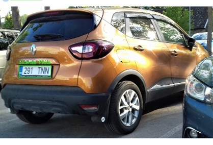
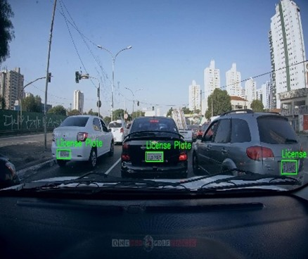

## Project Overview

# 🚘 Development of an Application for Blurring and Anonymizing Vehicle License Plates to Ensure Privacy

This project implements automatic license plate detection using YOLOv8, YOLOv10, and YOLOv12. The detected plates are blurred/anonymized to protect privacy.
We also compare the performance of these YOLO models based on accuracy and speed.

This repository provides a comprehensive solution for license plate detection and anonymization. It includes:

- **License Plate Detection**: Utilizing YOLOv8, YOLOv10, and YOLOv12 models to accurately detect license plates in images and videos.
- **Anonymization Techniques**: Implementing methods such as blurring, pixelation, and covering to anonymize detected license plates, ensuring privacy.
- **Model Comparison**: Evaluating and comparing the performance of different YOLO models to determine the most effective approach for detection and anonymization tasks.

This project aims to facilitate privacy-preserving applications in surveillance, autonomous driving, and public data sharing.

---

## 📂 Project Structure


```plaintext
.
├── README.md
└── license/
    ├── YOLO_v10/           # YOLOv10 trained model & results
    ├── YOLO_v12/           # YOLOv12 trained model & results
    ├── anonymization/      # Scripts & weights for anonymization
    │   ├── anonymize_v8_img.py
    │   ├── anonymize_v8_vid.py
    │   ├── anonymize_v10_img.py
    │   ├── anonymize_v10_vid.py
    │   ├── anonymize_v12_img.py
    │   ├── anonymize_v12_vid.py
    │   ├── best_v8.pt
    │   ├── best_v10.pt
    │   ├── best_v12.pt
    │   ├── requirements.txt
    │   ├── sample_inputs/      # Sample images & videos for testing
    │   └── sample_outputs/     # Output after anonymization
    ├── examples/           # Detection examples
    ├── data.yaml           # Dataset configuration
    └── runs/               # YOLOv8 training runs & results
```


## **LICENCSE PLATE DETECTION**


## ⚙️ Requirements / Installation

```bash
pip install --upgrade pip
pip install ultralytics
# Optional: GPU-enabled PyTorch (example for CUDA 11.8)
# pip install torch torchvision torchaudio --index-url https://download.pytorch.org/whl/cu118
```
## Check YOLO Version
```
yolo version
```

## 📂 Dataset

We used the [License Plate Detection Dataset (ANPR, YOLO Format)](https://www.kaggle.com/datasets/harshitsingh09/license-plate-detection-dataset-anpr-yolo-format) by **Harshit Singh** from Kaggle.

**What's Inside:**
- 🖼️ 661 total images  
- 🏷️ 658 annotation files in YOLO format  
- 🆔 Single class: `license plate`  
- 📁 Structured for direct use with YOLOv8  

> ⚠️ All rights for the dataset belong to the original authors. We only used it for research and academic purposes.


🗂 Prepare Dataset (YOLO Format)
Example data.yaml file:

```yaml
path: ./license
train: images/train
val: images/val
nc: 1
names: ['license_plate']
```

## 🚀 Training

Run the following command to train:

```bash
yolo task=detect mode=train model=<model>.pt data=./data.yaml epochs=100 imgsz=640 project=./runs name=<results_name>
```

- Replace <model> with yolov8n.pt, yolov10n.pt, or yolov12n.pt.
- Replace <results_name> with results_v8, results_v10, or results_v12.


📁 Output Location
Each run saves to:

```text
./runs/detect/<results_name>/
```

Inside this folder, you'll find:
```text
weights/best.pt          # Best model
weights/last.pt          # Final model
results.png              # Metrics plot
confusion_matrix.png     # Confusion matrix
```


## 📊 Model Accuracy & Speed Comparison

| Model    | Precision | Recall | mAP\@0.5 | mAP\@0.5:0.95 | Training Time (GPU, 100 epochs) |
| -------- | --------- | ------ | -------- | ------------- | ------------------------------- |
| YOLOv8n  | 0.930     | 0.920  | 0.933    | 0.920         | \~45 min                        |
| YOLOv10n | 0.942     | 0.791  | 0.918    | 0.570         | \~50 min                        |
| YOLOv12n | 0.884     | 0.895  | 0.928    | 0.584         | \~55 min                        |


## 🖼 Results & Sample Predictions

## Sample Results

| Sl.no | Input images                                        | Detected Outputs                                     |
| ----- | --------------------------------------------------- | ---------------------------------------------------- |
| 1     |  |  |
| 2     |  |  |
| 3     |  |  |


## 🔍 Inference 
To run inference on an image:

```bash
yolo task=detect mode=predict model=./runs/detect/<results_name>/weights/best.pt source=./examples/input1.jpg save=True
```
Replace <results_name> with results_v8, results_v10, or results_v12.


## Export Model (ONNX Format)

Export the trained model to ONNX format:

```bash
yolo export model=./runs/detect/<results_name>/weights/best.pt format=onnx
```
This generates a .onnx file for deployment in ONNX Runtime, TensorRT, or OpenCV.


## 📊 Evaluation

Validate model performance:

```bash
yolo task=detect mode=val model=./runs/detect/<results_name>/weights/best.pt data=./data.yaml save_json=True
```


## **ANONYMIZATION**

### Purpose:
The anonymization module aims to protect privacy by blurring license plates detected in images and videos. This prevents sensitive information from being exposed while still allowing the analysis of scenes or traffic flow.

### How it works: 
1. Detect license plates using one of the trained YOLO models (YOLOv8, YOLOv10, YOLOv12).  
2. For each detected license plate, apply an anonymization technique such as:  
   - Gaussian blur   
3. Save the processed image or video with anonymized license plates.

The script supports both image and video inputs.

### Anonymization Techniques Used

**Gaussian Blur:** Smooths the license plate area, making the text unreadable while maintaining a natural appearance.  

## Anonymization Scripts

This project supports anonymizing both images and videos using three different YOLO models (YOLOv8, YOLOv10, YOLOv12).
You can choose the model based on your preference for accuracy, speed, or model size.

**Image anonymization:**

- anonymization/anonymize_v8_img.py — YOLOv8
- anonymization/anonymize_v10_img.py — YOLOv10
- anonymization/anonymize_v12_img.py — YOLOv12


**Video anonymization:**

- anonymization/anonymize_v8_vid.py — YOLOv8
- anonymization/anonymize_v10_vid.py — YOLOv10
- anonymization/anonymize_v12_vid.py — YOLOv12


You can choose the script based on your preference for accuracy, speed, or model size.


### Usage Examples

Run the script corresponding to the model you want to use:

### 📂 Model Weights
The trained YOLO model weights required for anonymization are already included in the repository under:
```bash
license/anonymization/
│── best_v8.pt   # YOLOv8 weights
│── best_v10.pt  # YOLOv10 weights
│── best_v12.pt  # YOLOv12 weights
```
You can directly run the anonymization scripts without downloading additional files.
Each script is already configured to load its corresponding weight file from this folder.

Run the anonymization scripts by selecting required YOLO version (`v8`, `v10`, or `v12`).  
Just replace `<version>` with the desired model version.

### 🖼 Image Anonymization
```bash
python license/anonymization/anonymize_<version>_img.py --input license/anonymization/sample_inputs/input.jpg --output license/anonymization/sample_outputs/output.jpg --method blur
```

### 🎥 Video Anonymization
```bash
python license/anonymization/anonymize_<version>_vid.py --input license/anonymization/sample_inputs/input.mp4 --output license/anonymization/sample_outputs/output.mp4 --method blur
```

Command-line arguments:
| Argument   | Description                                           | Example                        |
| ---------- | ----------------------------------------------------- | ------------------------------ |
| `--input`  | Path to input image or video file                     | `input1.jpg` or `input1.mp4`   |
| `--output` | Path to save anonymized output                        | `output1.jpg` or `output1.mp4` |
| `--method` | Anonymization method (`blur`)                         | `blur`                         |

## Sample Outputs:

### Anonymized Images:

              
              


### Anonyimized Videos:


  
  


### Anonymization Method: Gaussian Blur

The anonymization in this project is done using **Gaussian blurring** on detected license plates.  

Gaussian blur is an image processing technique that smooths an image by averaging pixel values with their neighbors, weighted by a Gaussian function.  

In this project:
- The YOLO model detects the bounding boxes of license plates.
- The detected regions are extracted as Regions of Interest (ROI).
- A strong Gaussian blur (e.g., kernel size `(51, 51)`) is applied to the ROI to obscure any identifiable text or details.
- The blurred ROI is then placed back into the original image or video frame.

This ensures that the license plate is unreadable while the rest of the image or video remains intact.


## 📊 Results
The three YOLO models (YOLOv8, YOLOv10, and YOLOv12) were trained and evaluated on the same license plate detection dataset.

The key evaluation metrics — Precision, Recall, mAP@0.5, and mAP@0.5:0.95 — were computed for each model.


### Comparison graph


## Evaluation summary
| Model   | Precision | Recall | mAP\@0.5 | mAP\@0.5:0.95 |
| ------- | --------- | ------ | -------- | ------------- |
| YOLOv8  | 0.93      | 0.94   | 0.93     | 0.92          |
| YOLOv10 | 0.94      | 0.79   | 0.92     | 0.57          |
| YOLOv12 | 0.88      | 0.89   | 0.91     | 0.58          |


## Observations

- YOLOv8 achieved the highest recall and balanced performance across all metrics, making it suitable for scenarios where minimizing missed detections is critical.
- YOLOv10 achieved the highest precision, making it ideal when minimizing false positives is the priority, but recall was lower.
- YOLOv12 performed competitively in recall and mAP@0.5 but slightly lower in precision.
- mAP@0.5:0.95 scores indicate that YOLOv8 provides the best overall bounding box quality and consistency.


### Best Model Recommendation

For license plate anonymization, it is recommended to use **YOLOv8** because it offers the most balanced performance between detection accuracy and coverage.
If your priority is fewer false detections (higher precision), consider YOLOv10 instead.


## 📜 License & Authors

**All rights reserved**

### Authors:
- Bibikhuteja Soudagar
- R Prerana
- Megha T
- Sonali Chendake

### Contact:
- bibikhutejasoudagar21@gmail.com
- rprerana777@gmail.com
- meghatalawar22@gmail.com
- sonalichendake21@gmail.com
